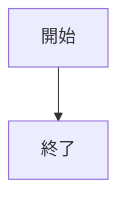
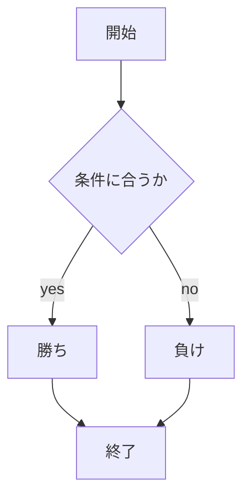
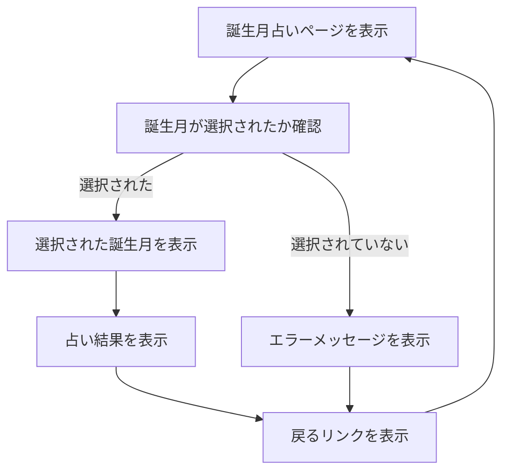
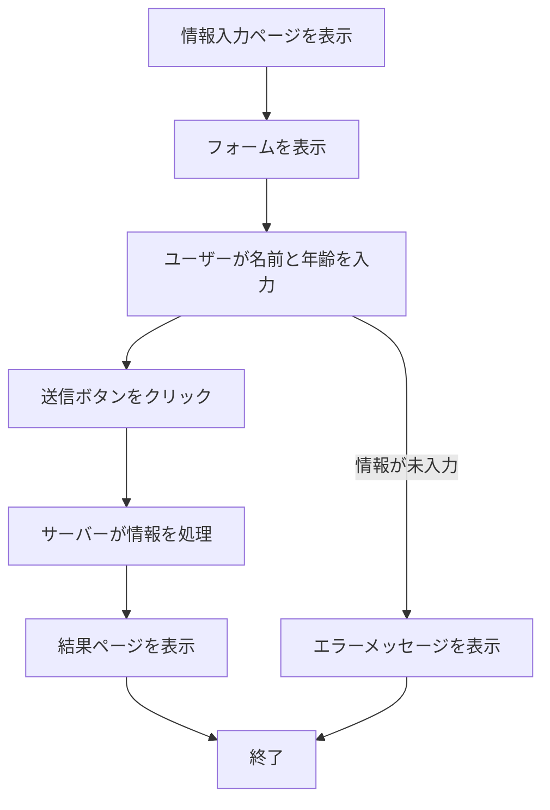

# webpro_06

1. app5.js を改造して，じゃんけん以外にユーザからの入力に対して結果を返す機能を2つ追加せよ．当然，必要に応じてhtmlファイルやテンプレートファイル（.ejs）を増やして構わない．

2. README.md を改造して，app5.js 全体のドキュメントを作成せよ．ドキュメントでは下記内容を丁寧に説明すること．
(1) 起動方法や編集したファイルをGitで管理する
(2) 機能ごとに，機能の説明，使用するための手順など

## このプログラムについて

##　　ファイル一覧

ファイル名 | 説明
-|-
app5.js | プログラム本体
public/janken.html | ジャンケンの開始画面 
public/index.html | 誕生月選択画面
public/form.html | 名前と年齢入力画面
views/birthday.ejs | 占い結果画面
views/result.ejs | 結果画面


```javascript
console.log('Hello');
```





---

# 追加した2つの機能について

## 1.誕生月占い
#### 使用方法 
1. node app5.jsを起動する
1. Webブラウザでlocalhost:8080/birthdayにアクセスする
1. 誕生月の選択をし、占うをクリックする


#### index.html , birthday.ejs



タグ | 説明
-|-
select | ドロップダウンメニューの表示
strong | 文字の強調
button(submit) | フォームの送信を行う

## 2.名前と年齢の入力
#### 使用方法 
1. node app6.jsを起動する
1. Webブラウザでlocalhost:8080/formにアクセスする
1. 自分の名前と年齢を入力し,送信をクリックする




## 機能
データがサーバーに送信されると、サーバーは /result というルートでそのデータを受け取ります。サーバーサイドでは、次のような処理が行われます：
1. 受け取った名前と年齢に基づいて、EJSテンプレート (result.ejs) にデータを渡して結果を表示します。
1. 年齢に応じて異なるメッセージを表示します。例えば：
1. 20歳未満: 若いですね！というメッセージ。
1. 20歳以上50歳未満: 大人の時間を楽しんでいるメッセージ。
1. 50歳以上: 人生経験が豊富なメッセージ。


### Gitでの管理
Githubに修正・追加したファイルをアップロードする
1. ターミナル上で編集したファイルのあるディレクトリに移動する
1. $ git add .
1. $ git commit -am 'コメント'
1. $ git push
この３つのコマンドを実行することでアップロードすることができる
### サーバーの立ち上げ方法
1. ターミナル上でターミナル上で適切なディレクトリに移動する
1. node app~.js を入力する
1. 終了する時は, control + c を押す


##　終わりに
app5.jsに３つ目のプログラムを追加したが,実行することがでできなかったため,新たにapp6.jsを作った.それにより実行することができたが,課題としてはapp5.jsに追加する形式なので,できなくてすみません.


### 参考資料
[JavaScript入門](https://www.javadrive.jp/javascript/#google_vignette)
[Qiita Markdown 書き方 まとめ](https://qiita.com/shizuma/items/8616bbe3ebe8ab0b6ca1)